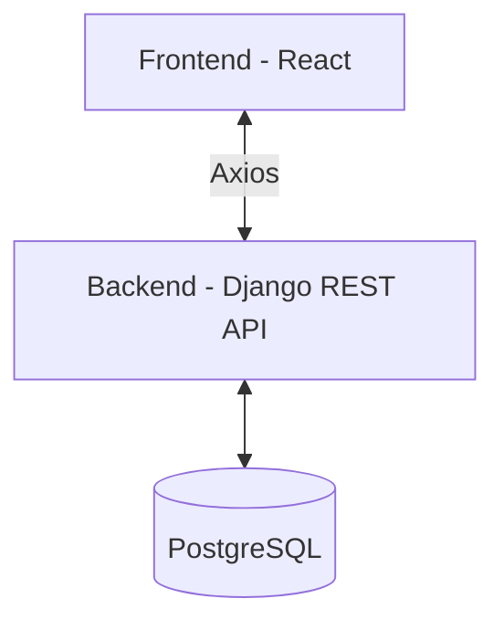

# 🧠 LabSync UNTELS

Sistema web para la **gestión y reserva de aulas/laboratorios** desarrollado como solución académica escalable, con arquitectura moderna basada en servicios.

---

# 📌 Descripción General

LabSync UNTELS es una plataforma que permite a estudiantes, docentes y personal administrativo:

- Reservar laboratorios y aulas
- Gestionar disponibilidad de recursos
- Autenticarse mediante roles
- Recuperar contraseñas de forma segura vía email

El sistema está diseñado siguiendo buenas prácticas de desarrollo web, separación frontend-backend y preparado para escalabilidad (Docker + Deploy).

---

# 🧱 Stack Tecnológico

## 🔙 Backend
- **Python 3.11+**
- **Django**: Framework web principal.
- **Django REST Framework**: Para la creación de la API.
- **PostgreSQL**: Base de datos relacional robusta.

## 🔜 Frontend
- **React**: Biblioteca para la interfaz de usuario.
- **Axios**: Cliente HTTP para conectar con el backend.
- **CSS modular**: Estilos organizados por componentes.

## 🔐 Autenticación
- Sistema basado en roles:
  - **Estudiante**
  - **Docente**
  - **Administrador**
  - **Jefatura**

## 📧 Servicios externos
- **SMTP Gmail**: Para el envío automático de correos (recuperación de cuenta).

---

# 🏗 Arquitectura



Arquitectura desacoplada que permite:
- Escalabilidad independiente.
- Fácil mantenimiento.
- Integración con otros servicios externos.

---

# 🚀 Funcionalidades

## 🔐 Autenticación

- **Login centralizado** mediante:
  - Código universitario
  - Contraseña
  - Selección de rol
- **Validación en backend**: Comprobación de existencia, contraseña (hash) y rol.
- **Protección de rutas**: El frontend restringe el acceso según el rol del usuario logueado.

---

## 🔑 Recuperación de Contraseña

Flujo completo implementado:

1. El usuario ingresa su correo en el modal de "Olvidé mi contraseña".
2. El backend genera un **código aleatorio de 6 caracteres**.
3. El código se guarda en la base de datos vinculado al usuario (`reset_token`).
4. Se envía un correo elegante mostrando el código bien visible (ej: **ABC123**).
5. El sistema redirige al usuario a la página de `/reset-password`.
6. El usuario ingresa el código manual y su nueva contraseña.
7. El backend valida el token, aplica la seguridad de Django y actualiza la credencial.

---

## 📧 Envío de Correos

Configuración via SMTP para Gmail integrada:

- **Host**: `smtp.gmail.com`
- **Puerto**: `587` (TLS)
- **Seguridad**: Uso de **App Passwords** para evitar exponer la contraseña real.

---

## 🔒 Seguridad implementada

- **Hashing de contraseñas**: Uso de `PBKDF2` (estándar de Django).
- **Tokens temporales**: Para procesos sensibles como el reset de password.
- **Validación de Roles**: Un usuario no puede entrar a dashboards que no le corresponden.
- **Manejo de Errores**: Respuestas HTTP claras (400, 403, 500) para el frontend.

---

# 📁 Estructura del Proyecto

```text
labsync-untels/
│
├── backend/
│   ├── reservas/               # Lógica de la aplicación
│   │   ├── models.py           # Definición de tablas (Usuario, Reserva, etc.)
│   │   ├── views.py            # Endpoints de la API (Login, Reset, etc.)
│   │   ├── migrations/         # Historial de base de datos
│   │
│   ├── config/                 # Configuración general de Django
│   │   ├── settings.py         # DB, Email, Apps instaladas
│   │   ├── urls.py             # Enrutamiento principal
│   │
│   ├── manage.py               # Utilidad de comandos Django
│   └── requirements.txt        # Dependencias de Python
│
├── frontend/
│   ├── src/
│   │   ├── pages/
│   │   │   ├── auth/           # Login.js, ResetPassword.js
│   │   │   ├── estudiante/     # Dashboards específicos
│   │   │   ├── docente/
│   │   │   ├── admin/
│   │   │   └── jefatura/
│   │   │
│   │   ├── components/         # ForgotPasswordModal.js, ProtectedRoute.js
│   │   ├── services/           # auth.js (Llamadas Axios)
│   │   └── styles/             # Login.css, ResetPassword.css, etc.
│   │
│   ├── package.json            # Dependencias de React
│   └── public/                 # Archivos estáticos
│
├── docker/                     # (En proceso) Archivos para despliegue
├── docker-compose.yml          # Orquestación de servicios
├── .env.example                # Plantilla de variables de entorno
└── README.md                   # Documentación principal
```

---

# ⚙️ API Endpoints

## 🔐 Login
`POST /api/login/`
```json
{
  "usuario": "20234567",
  "password": "mi_password_segura",
  "rol": "estudiante"
}
```

## 🔑 Forgot Password
`POST /api/forgot-password/`
```json
{
  "email": "usuario@untels.edu.pe"
}
```

## 🔁 Reset Password
`POST /api/reset-password/`
```json
{
  "token": "ABC123",
  "password": "nueva_password_123"
}
```

---

# 🧠 Problemas Resueltos y Retos

- **CORS & CSRF**: Configuración correcta para permitir comunicación entre puertos distintos (8000 y 3000).
- **Rutas en React**: Implementación de un `ProtectedRoute` para evitar accesos no autorizados.
- **Integración SMTP**: Configuración de Gmail para envío de correos en vivo.
- **Sincronización de BD**: Gestión de migraciones con PostgreSQL.

---

# 🔧 Requisitos para Desarrollo

- **Python 3.11+**
- **Node.js 18+**
- **PostgreSQL** (instalado y corriendo)
- **Git**

---

# 🚀 Ejecución del Proyecto

### Backend
```bash
cd backend
# Crear entorno virtual opcional
pip install -r requirements.txt
python manage.py migrate
python manage.py runserver
```

### Frontend
```bash
cd frontend
npm install
npm start
```

---

# 🔐 Variables de Entorno (.env)

Es necesario configurar los siguientes valores en el archivo `.env` del backend:

```env
DEBUG=True
DATABASE_NAME=labsync
DATABASE_USER=postgres
DATABASE_PASSWORD=tu_password
EMAIL_HOST_USER=tu_correo@gmail.com
EMAIL_HOST_PASSWORD=tu_app_password_de_gmail
```

---

# 📌 Estado Actual y Roadmap

- [x] Login funcional con roles
- [x] Recuperación de contraseña vía email real
- [x] Estructura base de dashboards por rol
- [x] Conexión a base de datos PostgreSQL
- [ ] Dockerización completa (Backend, Frontend, DB)
- [ ] Implementación de reserva de equipos específicos
- [ ] Generación de reportes PDF de asistencias
