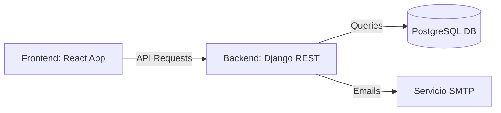

# 🧠 LabSync UNTELS

Sistema web para la **gestión y reserva de aulas/laboratorios** desarrollado como solución académica escalable, con arquitectura moderna basada en servicios.

---

# 📌 Descripción General

LabSync UNTELS es una plataforma que permite a estudiantes, docentes y personal administrativo:

- **Reservar laboratorios y aulas** de forma eficiente.
- **Gestionar disponibilidad** de recursos en tiempo real.
- **Autenticarse mediante roles** específicos.
- **Recuperar contraseñas** de forma segura vía email.

El sistema está diseñado siguiendo buenas prácticas de desarrollo web, con una clara separación entre el frontend y backend, preparado para escalabilidad y despliegue con Docker.

---

# 🧱 Stack Tecnológico

### 🔙 Backend
- **Python 3.11+**
- **Django**: Framework web robusto.
- **Django REST Framework (DRF)**: Para la exposición de servicios API.
- **PostgreSQL**: Motor de base de datos relacional.

### 🔜 Frontend
- **React**: Biblioteca de JavaScript para interfaces dinámicas.
- **Axios**: Comunicación fluida con el backend.
- **CSS Modular**: Estilos limpios y mantenibles.

### 🔐 Seguridad y Servicios
- **JWT / Session Management**: Manejo de sesiones por roles.
- **SMTP Gmail**: Integración para el envío de notificaciones y recuperación de cuentas.

---

# 🏗 Arquitectura del Sistema



Esta arquitectura desacoplada permite que el equipo de frontend y backend trabajen de forma independiente, facilitando el mantenimiento y futuras expansiones.

---

# 🚀 Funcionalidades Principales

## 🔐 Autenticación Inteligente
Login único basado en:
- Código Universitario / Usuario.
- Contraseña encriptada.
- Selección de Rol (Estudiante, Docente, Administrador, Jefatura).

## 🔑 Recuperación de Cuenta
Flujo interactivo integrado:
1. El usuario solicita el reset mediante su correo en un modal.
2. El sistema envía el código y el modal cambia automáticamente a una cuadrícula OTP.
3. Al ingresar el código correcto, el sistema redirige a la página de cambio de clave.
4. El usuario define su nueva contraseña con validaciones de seguridad en tiempo real.

---

# 📁 Estructura del Repositorio

```text
labsync-untels/
│
├── backend/                # Directorio del servidor Django
│   ├── reservas/           # App principal: Modelos, Vistas y Serialización
│   ├── config/             # Ajustes del proyecto (.env, settings, urls)
│   └── requirements.txt    # Librerías de Python
│
├── frontend/               # Directorio del cliente React
│   ├── src/
│   │   ├── pages/          # Vistas (Auth, Dashboards por Rol)
│   │   ├── components/      # Elementos reutilizables (Modales, Navbar)
│   │   └── services/       # Lógica de conexión con la API
│   └── package.json        # Dependencias de npm
│
├── .env.example            # Guía para variables de entorno
└── README.md               # Documentación actual
```

---

# ⚙️ API Endpoints (Resumen)

| Acción | Método | Endpoint | Descripción |
| :--- | :---: | :--- | :--- |
| **Login** | `POST` | `/api/login/` | Autenticación y retorno de datos de usuario. |
| **Recuperar** | `POST` | `/api/forgot-password/` | Envío de correo con token de reset. |
| **Reset** | `POST` | `/api/reset-password/` | Actualización de contraseña con token válido. |

---

# 🚀 Cómo empezar

### 1. Clonar y configurar Backend
```bash
cd backend
pip install -r requirements.txt
# Configurar archivo .env con credenciales de DB y Email
python manage.py migrate
python manage.py runserver
```

### 2. Configurar Frontend
```bash
cd frontend
npm install
npm start
```

---

# 🔒 Variables Críticas (.env)

Asegúrate de crear un archivo `.env` en la carpeta `backend/config/` con:
- `DB_NAME`, `DB_USER`, `DB_PASS`
- `EMAIL_HOST_USER` (Tu Gmail)
- `EMAIL_HOST_PASSWORD` (App Password)

---

# 📌 Estado del Proyecto

- [x] Backend API Base
- [x] Login & Roles funcionales
- [x] Sistema de recuperación de contraseña funcional
- [x] Conexión a PostgreSQL
- [ ] Dockerización (En curso)
- [ ] Módulo de Reservas Avanzado (Roadmap)
